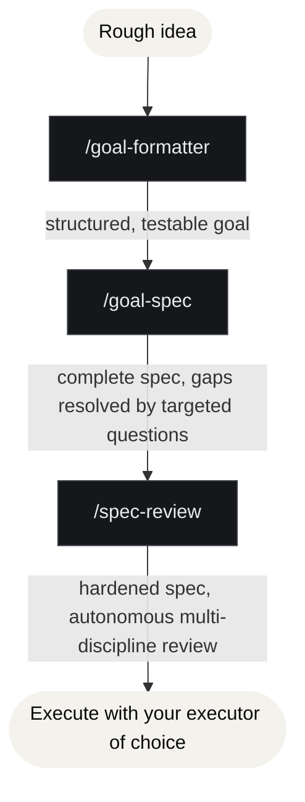

<!--
Copyright (c) 2026 JG Systems Consulting Ltd. MIT License (see LICENSE).
See LICENSE for terms.
-->

# JGS Goal-to-Spec Kit

   

**Copyright (c) 2026 JG Systems Consulting Ltd. MIT License (see LICENSE).**

A small, composable suite of Claude Code skills that turn a rough idea into a **hardened
engineering specification, ready to execute**. Three skills chain together:



The pack's job is to get you to a spec you can **trust enough to build from**. The skills do not
implement the spec themselves: execution is a separate, deliberate next step (see
"Then execute it" below). Authoring once and executing many ways is the point.

> [!NOTE]
> These skills are **tool-agnostic**: no external dependencies, no MCP server, just pure
> prompt-engineering workflows that work with any model or agent framework.

---

## Install with your AI agent

Copy everything in the block below and paste it into your coding agent
(Claude Code, Cursor, etc.). It will read this repo and install the pack for you.

```text
You are installing jgs-goal-spec, an open-source (MIT) Claude Code skills pack
(JG Systems Consulting Ltd.) that turns a rough idea into a hardened engineering
spec via three chained skills (goal-formatter → goal-spec → spec-review).
Repository: https://github.com/jgsystemsconsulting/jgs-goal-spec (version 1.2.0). Do this in order:

1. Read README.md, docs/skill-usage.md, and CHANGELOG.md so you understand what
   you are installing. There are NO external prerequisites; these skills call no
   MCP server and need no licence tier at runtime.
2. Run `python install.py --dry-run` and show me the skill list and target
   (~/.claude/skills/jgs-goal-spec/). If it looks right, run `python install.py`.
3. Verify: list the installed skills under the target and confirm the count matches SKILLS.md.
4. Tell me to restart Claude Code, then start with `/goal-formatter`.
5. This is MIT-licensed open-source software. Do not edit anything outside the install target.
```

---

## What's in this distribution

```
LICENSE                                MIT licence
README.md                              This file
SKILLS.md                              Skill index (auto-generated at release time)
CHANGELOG.md                           Version history
SECURITY.md                            How to report a vulnerability
install.py / install.sh / install.ps1  Installer scripts
skills/goal-formatter/                 Idea → structured, testable goal (+ optional draft spec)
skills/goal-spec/                      Goal → complete spec (asks gap-filling questions)
skills/spec-review/                    Spec → hardened spec (autonomous multi-discipline review)
docs/
  ├── skill-usage.md                   How to invoke and chain the skills, and how to execute the result
  └── other-agents.md                  Per-agent install paths and invocation
```

---

## Prerequisites

1. **Claude Code** (or another skill-capable client). `spec-review` spawns reviewer subagents,
   so a client that supports subagents gets the full autonomous loop; without subagents it can
   run the personas inline (one model voicing each), which is faster but less independent.
2. Nothing else. No MCP bridge, no external service, no licence-tier check at runtime.

---

## Installation & Invocation

**Option A: Plugin marketplace (recommended)**

```text
/plugin marketplace add jgsystemsconsulting/jgs-goal-spec
/plugin install jgs-goal-spec@jgs-goal-spec
```

Skills are namespaced when installed this way; invoke them as
`/jgs-goal-spec:goal-formatter`, `/jgs-goal-spec:goal-spec`, `/jgs-goal-spec:spec-review`.

**Option B: Installer script**

```bash
python install.py        # Claude Code (default); or ./install.sh / .\install.ps1
```

Installs into `~/.claude/skills/jgs-goal-spec/`; invoke flat as `/goal-formatter`,
`/goal-spec`, `/spec-review`. Restart Claude Code after installing.

### Use with other agents

These skills aren't Claude-only. Because they're pure prompt workflows in the portable `SKILL.md`
format, the installer can target several agents. Some read `SKILL.md` natively, others get an
automatic format transform:

```bash
python install.py --list-agents       # show every target and where it installs
python install.py --agent openclaw     # SKILL.md-native: copied unchanged
python install.py --agent gemini       # transformed to that agent's format
python install.py --agent all          # all user-global agents
```

| Agent | `--agent` | How it's installed | Invoke as |
|---|---|---|---|
| Claude Code *(default)* | `claude` | `SKILL.md` copied | `/goal-formatter` |
| OpenClaw | `openclaw` | `SKILL.md` copied | `/goal-formatter` |
| GitHub Copilot CLI | `copilot` | `SKILL.md` copied | `/goal-formatter` (then `/skills reload`) |
| OpenAI Codex CLI | `codex` | → `~/.codex/prompts/*.md` | `/prompts:goal-formatter` |
| Gemini CLI | `gemini` | → `~/.gemini/commands/*.toml` | `/jgs-goal-spec:goal-formatter` |
| Cursor *(project-local)* | `cursor` | → `./.cursor/rules/*.mdc` | `@goal-formatter` |

Transform targets keep the full workflow: any reference files (e.g. `goal-spec`'s spec template)
are inlined so each generated prompt is self-contained. Full details, paths, and limitations: see
[docs/other-agents.md](docs/other-agents.md).

---

## Quick usage

In any Claude Code conversation after installation:

1. `/goal-formatter`: describe your idea in plain language; get back a structured, testable
   goal. Add "and a spec" (or any spec-style ask) to also get a draft specification.
2. `/goal-spec`: turn that goal into a complete engineering spec. It asks you targeted
   clarifying questions for anything the goal left undecided, grounded in what you said you want.
3. `/spec-review`: harden the spec autonomously. A roundtable of engineering-discipline
   reviewers (architecture, security, test/QA, ops, product) critiques it round after round until
   no critical or major issues remain, with no check-ins required.

Full index: see [SKILLS.md](SKILLS.md). Usage guide: see [docs/skill-usage.md](docs/skill-usage.md).

---

## Then execute it

The hardened spec is the **input to execution, not the execution itself.** Once `spec-review`
reports convergence, hand the **goal + hardened spec** to an execution agent:

- **Claude Code `/goal`**: paste the goal; point it at the spec as the detailed design.
- **An autonomous loop** (autopilot / ralph-style runner): feed it the spec as the source of
  truth and let it implement to the spec's Success Criteria.
- **An `executor` subagent**: dispatch with the spec inline; verify its output against the
  spec's Success Criteria.

The spec's **Success Criteria** are the acceptance gate: execution is done when every criterion
is observably met. That's how the loop closes on a *built* outcome, not just a *written* one.

---

## Support & Security

For general help or to report a bug, open a [GitHub issue](https://github.com/jgsystemsconsulting/jgs-goal-spec/issues).

To report a **security** issue, do not open a public issue. Open a
[private security advisory](https://github.com/jgsystemsconsulting/jgs-goal-spec/security/advisories/new),
or open a pull request with the fix. See [SECURITY.md](SECURITY.md) for the full policy.

---

## Legal

This software is released under the [MIT License](LICENSE): you are free to use, copy,
modify, and distribute it, subject to the licence terms.

"JG Systems Consulting" is a trademark of JG Systems Consulting Ltd.
