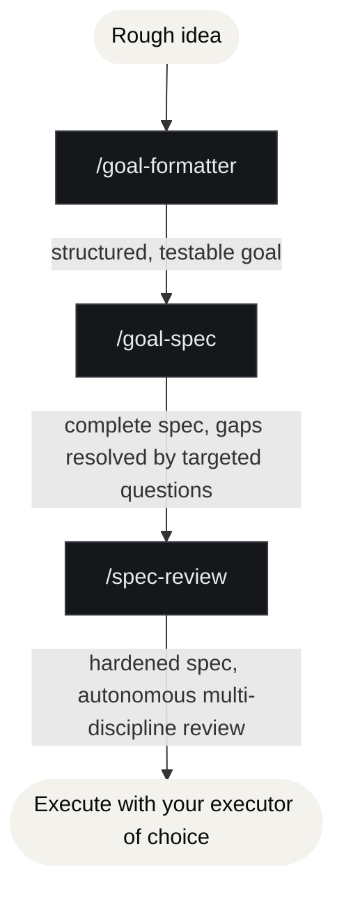

<!--
Copyright (c) 2026 JG Systems Consulting Ltd.
MIT License (see LICENSE).
-->

# Using the JGS Goal-to-Spec Kit

## What is a Claude Code skill?

A skill is a reusable workflow definition that Claude Code loads from a local file. Each skill has
a name, a description, and a body of instructions that tells Claude how to perform a specific task.
Skills are invoked in two ways:

1. **Explicitly**: you type `/<skill-name>` (for example, `/goal-formatter`).
2. **Implicitly**: Claude detects that a skill's description matches your request and invokes it.

These three skills are **tool-agnostic**: they call no MCP server and have no external runtime
dependency. They are pure prompt-engineering workflows that work with any model or agent.

## The chain at a glance

Each skill is independently useful, and they hand off cleanly because all three share one
**8-section engineering spec template** (`skills/goal-spec/references/spec-template.md`):
Problem & Context · Scope · Requirements · Constraints · Design Approach · Success Criteria ·
Risks & Mitigations · Open Questions.

## Skill 1: goal-formatter

Turns a verbal description into a structured, testable goal: measurable end state, success
criteria, verification method, constraints, and a test-coverage shape. It self-reviews the draft
against a rubric before presenting.

- Plain ask → **goal only**: "Write me a goal for X."
- Spec-style ask → **goal + draft spec**: "Write me a goal and a spec for X", "spec this out."
  The draft spec marks anything the description doesn't determine as `[GAP: …]` for goal-spec to
  resolve.

## Skill 2: goal-spec

Takes the goal (or goal + draft spec) and produces a **complete** engineering spec. Its defining
behaviour: it **asks you gap-filling clarifying questions**, grounded in what you said you wanted,
so each question reads as "to satisfy your goal of X, which of these…?" rather than a generic
survey. It resolves every gap (by asking, or by recording a sensible-default assumption), then
self-reviews the spec against a quality rubric.

Invoke with: "Spec this goal", "flesh out the spec", "define the specification."

## Skill 3: spec-review

Hardens the spec **autonomously**. Each round spawns a roundtable of independent
engineering-discipline reviewers (Architect, Security, Test/QA, Operations, Product) as separate
subagents that critique the spec from their own expertise. The orchestrator triages findings,
revises the spec in place, and loops until no CRITICAL or MAJOR findings remain (hard cap: 6
rounds). There are **no user checkpoints**: you get the converged spec and a round-by-round
summary at the end.

Invoke with: "Review this spec", "harden this spec", "run the roundtable on this spec."

> [!NOTE]
> If your client doesn't support subagents, spec-review can run the personas inline (one model
> voicing each discipline), faster, but with less genuine independence between reviewers.

## Then execute it

The kit's deliverable is a **trustworthy spec**, not a running system. Authoring ends at
convergence; execution is a separate, deliberate step you perform with whatever executor you like:

- **Claude Code `/goal`**: paste the goal; point it at the hardened spec as the detailed design.
- **An autonomous loop** (autopilot / ralph-style runner): feed it the spec as the source of
  truth and let it build to the spec's Success Criteria.
- **An `executor` subagent**: dispatch with the spec inline, then verify the output against the
  spec's Success Criteria and Verification section.

The spec's **Success Criteria** are the acceptance gate: the work is done when every criterion is
observably met. Run the executor, check against those criteria, iterate if any fail.

## Tips

- Run the three in order for a brand-new effort; jump in at `goal-spec` if you already have a
  goal, or at `spec-review` if you already have a spec.
- Keep the spec file on disk between steps so each skill can read and revise the same artifact.
- For high-stakes specs, read spec-review's round-by-round summary and the autonomous decisions it
  made on your Open Questions before you execute. That's where it filled gaps for you.
